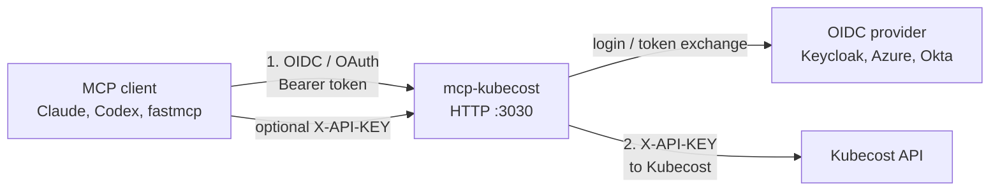
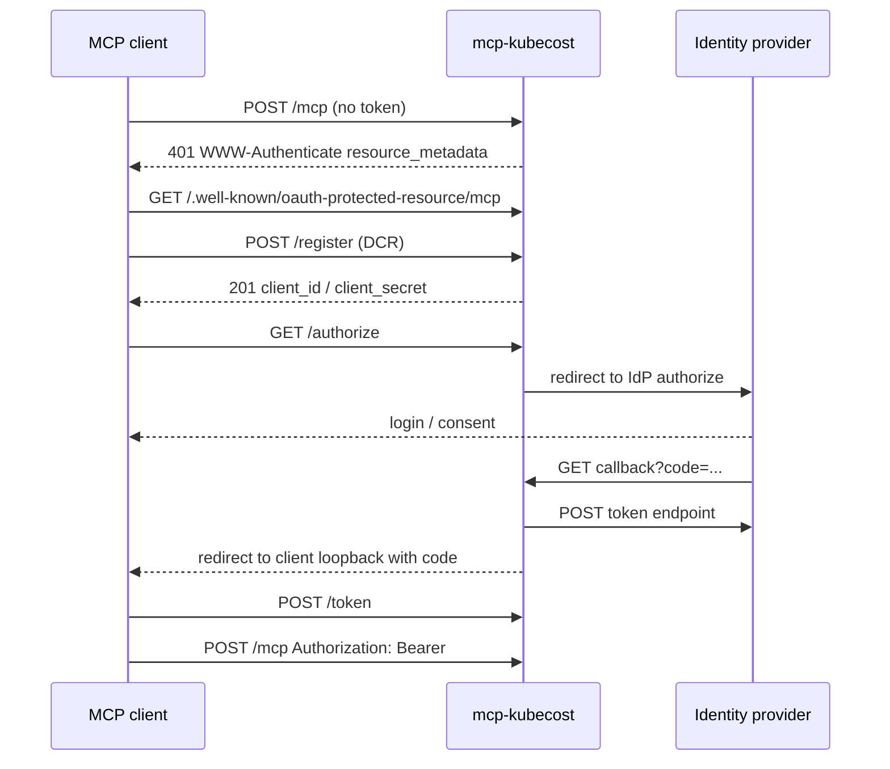
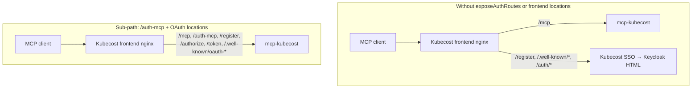

# Authentication and Security<!-- omit in toc -->

This server has two independent auth layers. One protects the **MCP HTTP endpoint** (who may call tools). The other authenticates **outbound calls to Kubecost** (which Kubecost tenant/credential the server uses). They are configured separately and can be combined.

- [Two layers](#two-layers)
- [AUTH_MODE](#auth_mode)
- [Protecting the MCP HTTP endpoint (OIDC)](#protecting-the-mcp-http-endpoint-oidc)
  - [OAuth proxy flow](#oauth-proxy-flow)
  - [Identity provider setup](#identity-provider-setup)
  - [Shared Kubecost frontend hostname](#shared-kubecost-frontend-hostname)
  - [Unauthenticated HTTP paths](#unauthenticated-http-paths)
- [Authenticating to Kubecost (API key)](#authenticating-to-kubecost-api-key)
- [Configuration](#configuration)
  - [Environment](#environment)
  - [Helm](#helm)
- [Pod hardening and TLS](#pod-hardening-and-tls)
- [STDIO vs HTTP](#stdio-vs-http)
- [Troubleshooting](#troubleshooting)

## Two layers



| Layer | Protects | Default |
|-------|----------|---------|
| MCP HTTP (`AUTH_MODE`) | Who can call `/mcp` | `none` — open |
| Kubecost API key | Outbound Kubecost requests | unset — unauthenticated |

STDIO has no HTTP headers, so MCP OIDC and `REQUIRE_CLIENT_API_KEY` do not apply there. Kubecost can still use `KUBECOST_API_KEY` from the environment.

## AUTH_MODE

`AUTH_MODE` (Helm: `config.oidc.authMode`) controls how the MCP HTTP endpoint is protected.

| Mode | MCP `/mcp` | Kubecost `X-API-KEY` |
|------|------------|----------------------|
| `none` | No auth | Optional env/header fallback |
| `oidc` | Valid OIDC token via FastMCP `OIDCProxy` | Optional env/header fallback |
| `api_key` | Incoming `X-API-KEY` required (same as `REQUIRE_CLIENT_API_KEY=true`) | That header is forwarded to Kubecost |
| `both` | OIDC token **and** an `X-API-KEY` header (presence check only) | Header is forwarded; env fallback is not used |

`oidc` and `both` require `OIDC_ISSUER_URL`, `OIDC_CLIENT_ID`, `OIDC_CLIENT_SECRET`, and `OIDC_BASE_URL`.

## Protecting the MCP HTTP endpoint (OIDC)

When `AUTH_MODE=oidc` (or `both`), the server builds a FastMCP [`OIDCProxy`](https://gofastmcp.com/servers/auth/oidc-proxy). MCP clients speak the MCP OAuth spec to **this server**. This server then talks to the upstream identity provider (Keycloak, Azure AD, Okta, IBM IAM, …).

OAuth client registrations and tokens stay in **process memory** (`MemoryStore`). That is required for `readOnlyRootFilesystem`: FastMCP’s default file store mkdirs under `~/.local/share/fastmcp/oauth-proxy/` and fails on a read-only root. Clients re-register after a pod restart. Consent is delegated to the identity provider (`require_authorization_consent="external"`).

### OAuth proxy flow



### Identity provider setup

Register a confidential OAuth client on the provider. The **Valid redirect URI** is this server’s callback, not the MCP client’s localhost URL:

```
{OIDC_BASE_URL}{OIDC_REDIRECT_PATH}
```

`OIDC_REDIRECT_PATH` defaults to `/auth/callback`. Example: `OIDC_BASE_URL=https://mcp.example.com` → add `https://mcp.example.com/auth/callback`.

When this server is a **sub-path on a Kubecost frontend** (`https://kubecost.example.com/mcp`), use `/auth-mcp` instead — see [Shared Kubecost frontend hostname](#shared-kubecost-frontend-hostname). Register that path **exactly**; do not append `/callback`.

The MCP client’s own redirect (`http://localhost:<port>/callback` or Claude’s `https://claude.ai/api/mcp/auth_callback`) is registered with FastMCP via DCR. Do not put those URLs on the identity provider.

`OIDC_ISSUER_URL` is the provider’s discovery document, for example:

| Provider | `OIDC_ISSUER_URL` |
|----------|-------------------|
| Keycloak | `https://{host}/realms/{realm}/.well-known/openid-configuration` |
| Azure AD | `https://login.microsoftonline.com/{tenant}/v2.0/.well-known/openid-configuration` |
| Okta | `https://{domain}/.well-known/openid-configuration` |
| IBM IAM | `https://iam.cloud.ibm.com/identity/.well-known/openid-configuration` |

Optional: `OIDC_AUDIENCE` when the provider issues JWT access tokens for a specific API audience. `OIDC_REQUIRED_SCOPES` defaults to `openid,profile`.

IBM w3id (and some other providers) issue **opaque** access tokens, not JWTs. FastMCP then fails with `invalid_token` / `Failed to extract key ID from token` after a successful login, and MCP clients never list tools. Set `OIDC_VERIFY_ID_TOKEN=true` (Helm: `config.oidc.verifyIdToken`) so the proxy validates the `id_token` instead. Leave this off for Keycloak. Do not set `OIDC_AUDIENCE` when it is on — the `id_token` audience is the OAuth client id.

### Shared Kubecost frontend hostname

Use this when the MCP endpoint is a **sub-path on the Kubecost frontend**, for example `https://kubecost.example.com/mcp`, rather than a dedicated MCP hostname.

That nginx typically proxies only `/mcp` and runs `auth_request` on everything else. MCP OAuth then hits Kubecost SSO and the client receives an HTML login page instead of JSON. Kubecost also owns `location /auth` (aggregator `/isAuthenticated`). FastMCP’s default callback `/auth/callback` sits under that prefix, so Keycloak’s return never reaches this server.

Set the callback to `/auth-mcp` — a sibling of `/mcp`, not a child of `/auth`:

| | Dedicated MCP host | Sub-path on Kubecost |
|---|---|---|
| MCP URL | `https://mcp.example.com/mcp` | `https://kubecost.example.com/mcp` |
| `OIDC_BASE_URL` | `https://mcp.example.com` | `https://kubecost.example.com` |
| `OIDC_REDIRECT_PATH` | `/auth/callback` (default) | `/auth-mcp` |
| IdP Valid redirect URI | `https://mcp.example.com/auth/callback` | `https://kubecost.example.com/auth-mcp` |

Helm: `config.oidc.redirectPath=/auth-mcp`. The IdP URI is `{OIDC_BASE_URL}/auth-mcp` **exactly** — do not append `/callback` (`/auth-mcp/callback` is not a path this server serves).

`/auth-mcp` must be a longer nginx prefix than `/auth`, or `/auth-mcp` is still treated as Kubecost `auth_request`. Proxy these paths to this Service **without** `auth_request` (frontend nginx extra locations, or `config.oidc.exposeAuthRoutes`):

- `/mcp`, `/auth-mcp`
- `/register`, `/authorize`, `/token`, `/consent`
- `/.well-known/oauth-protected-resource`, `/.well-known/oauth-authorization-server`



If you cannot change the Kubecost frontend nginx, set `config.oidc.exposeAuthRoutes=true` so this chart creates an Ingress for those paths on the host from `config.oidc.baseUrl`. Point `config.oidc.authIngress.tlsSecretName` at the existing TLS secret when the host already terminates TLS. Do **not** Ingress-prefix `/auth`.

A dedicated MCP hostname (chart `httpRoute` / `ingress`) avoids this entirely: keep the default `/auth/callback` and put OAuth routes at `/` on that host.

### Unauthenticated HTTP paths

These FastMCP custom routes are **not** wrapped in OAuth middleware. Kubernetes probes must use them — kubelet cannot present OIDC or `X-API-KEY`.

| Path | Purpose |
|------|---------|
| `GET /health` | Liveness / readiness (chart default `probes.path`) |
| `GET /version` | Package version |

Uvicorn access logs for `GET /health` are dropped. Do not point probes at `/mcp`.

## Authenticating to Kubecost (API key)

By default the server calls Kubecost unauthenticated. That is fine for the public demo, local port-forwards, or when another layer already authenticates to Kubecost.

Kubecost Enterprise with SAML/OIDC/RBAC expects an API key. The key is sent to Kubecost as an **`X-API-KEY` request header**. There is no Basic auth.

| Source | Scope |
|--------|-------|
| `X-API-KEY` on the incoming MCP request | Per request — HTTP transport only |
| `KUBECOST_API_KEY` environment variable | Process-wide fallback |

Header wins when both are set. Neither is required; with no key the outbound request is unauthenticated.

`REQUIRE_CLIENT_API_KEY=true` (Helm: `config.requireClientApiKey`) rejects HTTP requests that arrive without the header. The check runs **before** the environment fallback, so a configured `KUBECOST_API_KEY` does not satisfy it. STDIO is never gated.

`AUTH_MODE=both` is the same presence check alongside OIDC: the client must send `X-API-KEY`; the value is forwarded as-is and not validated here.

Prefer a pre-created Secret (`config.kubecostApiKey.existingSecret`) over putting the key in a values file.

## Configuration

Templates: [`.env.example`](.env.example) and [`charts/mcp-kubecost/values.yaml`](charts/mcp-kubecost/values.yaml). All settings flow through [`get_settings()`](src/mcp_kubecost/config/settings.py).

### Environment

| Variable | Helm | Role |
|----------|------|------|
| `AUTH_MODE` | `config.oidc.authMode` | `none` / `oidc` / `api_key` / `both` |
| `OIDC_ISSUER_URL` | `config.oidc.issuerUrl` | Provider discovery URL |
| `OIDC_CLIENT_ID` | `config.oidc.clientId` or Secret | Confidential client id |
| `OIDC_CLIENT_SECRET` | `config.oidc.clientSecret` or Secret | Confidential client secret |
| `OIDC_BASE_URL` | `config.oidc.baseUrl` | Public URL of this MCP server |
| `OIDC_REDIRECT_PATH` | `config.oidc.redirectPath` | IdP callback path. Default `/auth/callback`. Use `/auth-mcp` (no `/callback` suffix) when MCP is a sub-path on a Kubecost frontend |
| `OIDC_AUDIENCE` | `config.oidc.audience` | Optional token audience (JWT access tokens only) |
| `OIDC_VERIFY_ID_TOKEN` | `config.oidc.verifyIdToken` | Verify `id_token` instead of the access token; required for IBM w3id opaque tokens |
| `OIDC_REQUIRED_SCOPES` | `config.oidc.requiredScopes` | Default `openid,profile` |
| `KUBECOST_API_KEY` | `config.kubecostApiKey` | Fallback key sent to Kubecost |
| `REQUIRE_CLIENT_API_KEY` | `config.requireClientApiKey` | Require inbound `X-API-KEY` on HTTP |
| `KUBECOST_SSL_VERIFY` | `config.ssl.verify` | TLS verify for Kubecost |
| `SSL_CA_BUNDLE` | `config.ssl.caBundle` | Custom CA path (implies verify) |
| `FASTMCP_HTTP_ALLOWED_HOSTS` | `config.fastmcpHttpAllowedHosts` | JSON array of allowed `Host` headers; empty disables |

OIDC client credentials in Helm: set `config.oidc.existingSecret` (keys `OIDC_CLIENT_ID` and `OIDC_CLIENT_SECRET`) or `clientId` / `clientSecret` (the chart will mint a Secret).

### Helm

```bash
helm upgrade --install mcp-kubecost ./charts/mcp-kubecost \
  --namespace mcp-kubecost --create-namespace \
  --set config.kubecostBaseUrl=https://kubecost.example.com \
  --set config.kubecostApiKey.existingSecret=kubecost-api-key \
  --set config.oidc.authMode=oidc \
  --set config.oidc.issuerUrl=https://keycloak.example.com/realms/kubecost/.well-known/openid-configuration \
  --set config.oidc.baseUrl=https://mcp.example.com \
  --set config.oidc.existingSecret=mcp-oidc \
  --set config.oidc.exposeAuthRoutes=true \
  --set config.oidc.authIngress.tlsSecretName=mcp-tls
```

When MCP is a sub-path on the Kubecost frontend (`https://kubecost.example.com/mcp`), also set `config.oidc.redirectPath=/auth-mcp` and register that exact URI on the IdP. `exposeAuthRoutes` is off by default; turn it on only if the frontend nginx does not already proxy the OAuth paths.

## Pod hardening and TLS

The chart defaults are meant for a locked-down runtime:

- non-root UID/GID `65532`, `runAsNonRoot`, `RuntimeDefault` seccomp
- `readOnlyRootFilesystem`, all capabilities dropped, no privilege escalation
- `automountServiceAccountToken: false`
- OIDC state in memory so the root filesystem can stay read-only

For a custom Kubecost CA, put the cert in a Secret and set `config.ssl.caBundle.existingSecret` / `key`. The chart mounts it read-only and sets `SSL_CA_BUNDLE`.

Never commit `.env`, tokens, or secrets. CI scans for secret patterns and large files.

## STDIO vs HTTP

| | STDIO | HTTP |
|---|--------|------|
| Typical use | Local IDE / desktop | Shared or Kubernetes service |
| MCP OIDC | Not used | `AUTH_MODE=oidc` or `both` |
| Inbound `X-API-KEY` | Cannot send headers | Optional or required |
| Kubecost key | `KUBECOST_API_KEY` env | Header, then env |

Local HTTP: `uv run fastmcp run fastmcp-http.json` (port 3030).

## Troubleshooting

**MCP client panics parsing HTML on `/register` or `/.well-known/...`**
Kubecost frontend SSO intercepted the OAuth path. Enable `config.oidc.exposeAuthRoutes`, or give the MCP server its own hostname.

**Keycloak `invalid_redirect_uri`**
Add `{OIDC_BASE_URL}{OIDC_REDIRECT_PATH}` to the client’s Valid redirect URIs — the value in the Keycloak error URL’s `redirect_uri=` query param. Default is `{OIDC_BASE_URL}/auth/callback`. On a Kubecost sub-path that is `{OIDC_BASE_URL}/auth-mcp` with no extra `/callback`. Do not add the MCP client’s localhost or Claude callback there.

**Pod crash on start with read-only root / `mkdir` under `.local/share/fastmcp`**
OIDC file storage tried to write to disk. Current builds use `MemoryStore`; rebuild/redeploy if the image predates that change.

**Probes failing with 401**
`probes.path` must be `/health`, not `/mcp`.

**OIDC init error about HTML discovery metadata**
`OIDC_ISSUER_URL` must be the provider’s `/.well-known/openid-configuration` JSON URL, not a login page and not this server’s `/mcp` URL.

**Login succeeds but `/mcp` returns `invalid_token` / tools never appear**
The IdP issued an opaque access token (IBM w3id does this). Logs show `Failed to extract key ID from token` and `Upstream token validation failed`. Set `OIDC_VERIFY_ID_TOKEN=true` (Helm: `config.oidc.verifyIdToken: true`) and redeploy. Leave it off for Keycloak JWT access tokens.
