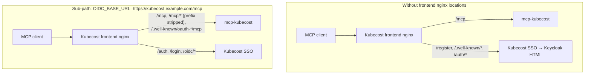

# Authentication and Security<!-- omit in toc -->

This server has two independent auth, optional, layers. One protects the **MCP HTTP endpoint** (who may call tools). The other authenticates **outbound calls to Kubecost** (which Kubecost tenant/credential the server uses). They are configured separately and can be combined.

- [Authentication options](#authentication-options)
- [Protecting the MCP HTTP endpoint (OIDC)](#protecting-the-mcp-http-endpoint-oidc)
  - [Identity provider setup](#identity-provider-setup)
  - [Reusing the Kubecost UI's OIDC client](#reusing-the-kubecost-uis-oidc-client)
  - [Shared Kubecost frontend hostname](#shared-kubecost-frontend-hostname)
  - [Unauthenticated HTTP paths](#unauthenticated-http-paths)
- [Kubecost API keys](#kubecost-api-keys)
- [Configuration](#configuration)
  - [Environment](#environment)
  - [Helm](#helm)
- [Pod hardening and TLS](#pod-hardening-and-tls)
- [STDIO vs HTTP](#stdio-vs-http)
- [Troubleshooting](#troubleshooting)

## Authentication options

`AUTH_MODE` (Helm: `config.authMode`) controls how the MCP HTTP endpoint is protected.

| Mode      | MCP `/mcp`                                                            | Kubecost `X-API-KEY`         |
| --------- | --------------------------------------------------------------------- | ---------------------------- |
| `none`    | No auth — **not permitted when `httproute` or `ingress` is enabled**  | Optional env/header fallback |
| `open`    | No auth enforcement; explicitly acknowledged as exposed               | Optional env/header fallback |
| `oidc`    | Valid OIDC token via FastMCP `OIDCProxy`                              | Optional env/header fallback |
| `api_key` | Incoming `X-API-KEY` required (same as `REQUIRE_CLIENT_API_KEY=true`) | Header forwarded to Kubecost |

`oidc` requires `OIDC_ISSUER_URL`, `OIDC_CLIENT_ID`, `OIDC_CLIENT_SECRET`, and `OIDC_BASE_URL`.

> [!TIP]
> To require **both** OIDC identity and a per-request `X-API-KEY`, set `authMode: oidc` and `requireClientApiKey: true`.

> [!WARNING]
> If `httproute.enabled: true` or `ingress.enabled: true`, `authMode` must **not** be `"none"`.
> Set `authMode` to at least `"open"` to acknowledge the exposure, or to a stricter mode such as `"oidc"` or `"api_key"`.
> Helm will fail pre-install/pre-upgrade if this constraint is violated.
>
> ```yaml
> # values.yaml — minimum required when exposing a route
> config:
>   authMode: "open" # or oidc / api_key
> httpRoute:
>   enabled: true
> ```

## Protecting the MCP HTTP endpoint (OIDC)

When `AUTH_MODE=oidc`, the server builds a FastMCP [`OIDCProxy`](https://gofastmcp.com/servers/auth/oidc-proxy). MCP clients speak the MCP OAuth spec to **this server**. This server then talks to the upstream identity provider.

OAuth client registrations and tokens stay in **process memory** (`MemoryStore`). That is required for `readOnlyRootFilesystem`: FastMCP’s default file store mkdirs under `~/.local/share/fastmcp/oauth-proxy/` and fails on a read-only root. Clients re-register after a pod restart. Consent is delegated to the identity provider (`require_authorization_consent="external"`).


### Identity provider setup


`OIDC_REDIRECT_PATH` defaults to `/auth-mcp` — most deployments run this server as a sub-path on an existing Kubecost frontend, so the default targets that case. Example: `OIDC_BASE_URL=https://kubecost.example.com/mcp` → add `https://kubecost.example.com/mcp/auth-mcp`. Register that path **exactly**; do not append `/callback`. The redirect URI always includes the path prefix from `OIDC_BASE_URL`, so changing that prefix means re-registering the URI at the IdP.

When this server has a **dedicated hostname** (not a Kubecost sub-path), use `/auth/callback` instead — see [Shared Kubecost frontend hostname](#shared-kubecost-frontend-hostname) for why `/auth-mcp` is otherwise required.

The MCP client’s own redirect (`http://localhost:<port>/callback` or Claude’s `https://claude.ai/api/mcp/auth_callback`) is registered with FastMCP via DCR. Do not put those URLs on the identity provider. This server allowlists those MCP-client redirects (`http://localhost:*`, `http://127.0.0.1:*`, and Claude’s callback) so an unknown `client_id` after a pod restart cannot open-redirect to an arbitrary host. The IdP Valid redirect URI remains only `{OIDC_BASE_URL}{OIDC_REDIRECT_PATH}`.

`OIDC_ISSUER_URL` is the provider’s discovery document, for example: `https://{domain}/.well-known/openid-configuration`.

Optional: `OIDC_AUDIENCE` when the provider issues JWT access tokens for a specific API audience. Do not set it for providers that issue opaque access tokens — those are verified via the `id_token`, whose audience is the OAuth client id. `OIDC_REQUIRED_SCOPES` defaults to `openid,profile`.

Some other providers issue **opaque** access tokens, not JWTs. The server detects that from the token response and verifies the `id_token` instead. JWT access-token issuers (Keycloak, typical Azure/Okta) keep access-token verification. No extra setting is required.

### Reusing the Kubecost UI's OIDC client

Kubecost supports OIDC natively, so a cluster running both Kubecost and this server has two applications needing an OAuth client. One shared client does work if both callbacks are registered on it — but this is not recommended. A second client does not add a second login (the session lives at the identity provider), while a shared one couples the secret, the redirect-URI allowlist, the token audience, and every per-client policy and audit control across a browser UI and an agent-driven API.

Full reasoning, the recommended per-client settings, compensating controls if you must share, and migration steps: [`oidc-client-sharing.md`](oidc-client-sharing.md).

### Shared Kubecost frontend hostname

Use this when the MCP endpoint is a **sub-path on the Kubecost frontend**, for example `https://kubecost.example.com/mcp`, rather than a dedicated MCP hostname.

That nginx typically proxies only `/mcp` and runs `auth_request` on everything else. MCP OAuth then hits Kubecost SSO and the client receives an HTML login page instead of JSON. Kubecost also owns `location /auth` (aggregator `/isAuthenticated`). FastMCP's own default callback `/auth/callback` sits under that prefix, so Keycloak's return would never reach this server if you switched back to it here — which is why `/auth-mcp` is this server's default.

On a shared Kubecost hostname, give `OIDC_BASE_URL` a **path prefix**. FastMCP
builds its advertised OAuth endpoints from that base URL, so the whole OAuth
surface moves under the prefix and nothing claims a bare root path on a host
that Kubecost SSO also owns:

|                        | Sub-path on Kubecost (recommended)          | Dedicated MCP host                      |
| ---------------------- | ------------------------------------------- | --------------------------------------- |
| MCP URL                | `https://kubecost.example.com/mcp`          | `https://mcp.example.com/mcp`           |
| `OIDC_BASE_URL`        | `https://kubecost.example.com/mcp`          | `https://mcp.example.com`               |
| `MCP_HTTP_PATH`        | `/` (derived; `config.http.path`)           | `/mcp` (default)                        |
| `OIDC_REDIRECT_PATH`   | `/auth-mcp` (default)                       | `/auth/callback`                        |
| IdP Valid redirect URI | `https://kubecost.example.com/mcp/auth-mcp` | `https://mcp.example.com/auth/callback` |

The IdP URI is `{OIDC_BASE_URL}{OIDC_REDIRECT_PATH}` **exactly** — do not append
`/callback` (`/auth-mcp/callback` is not a path this server serves).

With a path-prefixed `OIDC_BASE_URL`, the frontend nginx strips the prefix and
this server serves everything at its root, so `config.http.path` must be `/`
(this chart derives that for you from `config.oidc.baseUrl`). The prefix-stripping
locations belong to whoever owns the Kubecost frontend nginx. The paths that
must reach this Service **without** `auth_request`, with the prefix stripped:

- `/mcp` and `/mcp/*` — the MCP endpoint plus `/mcp/authorize`, `/mcp/token`, `/mcp/register`, `/mcp/consent`, `/mcp/auth-mcp`
- `/.well-known/oauth-protected-resource/mcp/` — RFC 9728; clients derive it from the resource identifier, so it can only live at the host root. Note the **trailing slash**: with `MCP_HTTP_PATH=/` the resource identifier is `https://kubecost.example.com/mcp/`, and FastMCP registers the metadata route to match. Use a prefix match (`location /.well-known/oauth-protected-resource/mcp`), not an exact `location =`, so both spellings resolve.
- `/.well-known/oauth-authorization-server/mcp` — RFC 8414 discovery for issuer `.../mcp`, rewritten to `/.well-known/oauth-authorization-server` because FastMCP registers that route at this server's root

An nginx sketch for the first two, on the Kubecost frontend:

```nginx
# Host and port follow the chart's Service: {release}-mcp-kubecost on service.port (default 3030).
location /mcp/ {
    proxy_pass http://mcp-kubecost.mcp-kubecost.svc.cluster.local:3030/;  # trailing / strips the prefix
    proxy_set_header Host $host;
    proxy_set_header X-Forwarded-Proto $scheme;
}
location /.well-known/oauth-protected-resource/mcp {
    proxy_pass http://mcp-kubecost.mcp-kubecost.svc.cluster.local:3030;
}
```

Leaving `OIDC_BASE_URL` at a host root keeps the older layout, where `/authorize`,
`/token`, `/register` and `/.well-known/oauth-authorization-server` are claimed at
the root of the shared host and `/auth-mcp` must stay a longer nginx prefix than
Kubecost's `/auth`, or it is still treated as `auth_request`.



If you cannot change the Kubecost frontend nginx, the cleanest resolution is to give the MCP server its own hostname via `httpRoute` or `ingress`, set `config.oidc.baseUrl` to that root hostname (no path prefix), and set `config.oidc.redirectPath=/auth/callback`.

### Unauthenticated HTTP paths

These FastMCP custom routes are **not** wrapped in OAuth middleware. Kubernetes probes must use them — kubelet cannot present OIDC or `X-API-KEY`.

| Path           | Purpose                                            |
| -------------- | -------------------------------------------------- |
| `GET /health`  | Liveness / readiness (chart default `probes.path`) |
| `GET /version` | Package version                                    |

Uvicorn access logs for `GET /health` are dropped. Do not point probes at `/mcp`.

## Kubecost API keys

By default the server calls Kubecost unauthenticated. That is fine for local port-forwards, or when another layer already authenticates to Kubecost.

When using Kubecost Enterprise with SSO enabled, Kubecost expects an API key. The key is sent as an **`X-API-KEY` request header**.

The MCP supports both per MCP client keys or a shared key assigned to the MCP server.

| Source                                  | Scope                             |
| --------------------------------------- | --------------------------------- |
| `X-API-KEY` on the incoming MCP request | Per request — HTTP transport only |
| `KUBECOST_API_KEY` environment variable | Process-wide fallback             |

Header wins when both are set. Neither is required; with no key the outbound request is unauthenticated.

`REQUIRE_CLIENT_API_KEY=true` (Helm: `config.requireClientApiKey`) rejects HTTP requests that arrive without the header. The check runs **before** the environment fallback, so a configured `KUBECOST_API_KEY` does not satisfy it. STDIO is never gated.

## Configuration

Templates: [`.env.example`](../../.env.example) and [`charts/mcp-kubecost/values.yaml`](../../charts/mcp-kubecost/values.yaml). All settings flow through [`get_settings()`](../../src/mcp_kubecost/config/settings.py).

### Environment

| Variable                     | Helm                                 | Role                                                                                           |
| ---------------------------- | ------------------------------------ | ---------------------------------------------------------------------------------------------- |
| `AUTH_MODE`                  | `config.authMode`                    | `none` / `open` / `oidc` / `api_key`                                                           |
| `OIDC_ISSUER_URL`            | `config.oidc.issuerUrl`              | Provider discovery URL                                                                         |
| `OIDC_CLIENT_ID`             | `config.oidc.clientId` or Secret     | Confidential client id                                                                         |
| `OIDC_CLIENT_SECRET`         | `config.oidc.clientSecret` or Secret | Confidential client secret                                                                     |
| `OIDC_BASE_URL`              | `config.oidc.baseUrl`                | Public URL of this MCP server. A path prefix (`https://host/mcp`) moves every OAuth endpoint under it |
| `MCP_HTTP_PATH`              | `config.http.path`                   | Route the MCP endpoint is served on. Derived: `/` when `OIDC_BASE_URL` has a path prefix, else `/mcp`. Read by the container entrypoint, not `get_settings()` — see note below |
| `OIDC_REDIRECT_PATH`         | `config.oidc.redirectPath`           | IdP callback path. Default `/auth-mcp`. Use `/auth/callback` when MCP has a dedicated hostname |
| `OIDC_AUDIENCE`              | `config.oidc.audience`               | Optional token audience (JWT access tokens only; omit for opaque IdPs)                         |
| `OIDC_REQUIRED_SCOPES`       | `config.oidc.requiredScopes`         | Default `openid,profile`                                                                       |
| `KUBECOST_API_KEY`           | `config.kubecostApiKey.existingSecret` | Name of a pre-created Secret whose key (default `KUBECOST_API_KEY`) holds the fallback key sent to Kubecost. Create with: `kubectl create secret generic <name> --from-literal=KUBECOST_API_KEY=<key>` — or provision via CI/CD. |
| `REQUIRE_CLIENT_API_KEY`     | `config.requireClientApiKey`         | Require inbound `X-API-KEY` on HTTP                                                            |
| `KUBECOST_SSL_VERIFY`        | `config.ssl.verify`                  | TLS verify for Kubecost                                                                        |
| `SSL_CA_BUNDLE`              | `config.ssl.caBundle`                | Custom CA path (implies verify)                                                                |
| `FASTMCP_HTTP_ALLOWED_HOSTS` | `config.fastmcpHttpAllowedHosts`     | JSON array of allowed `Host` headers; empty disables                                           |

`MCP_HTTP_PATH` is the one entry in that table not read through `get_settings()`. It shapes the `fastmcp run --path` argv, so [`otel_entrypoint.py`](../../src/mcp_kubecost/otel_entrypoint.py) reads it before the server process exists. The entrypoint calls `load_dotenv()` itself, so `.env` works; but running `uv run fastmcp run fastmcp-http.json` bypasses the entrypoint entirely and ignores the variable — pass `--path` on the command line for that case.

OIDC client credentials in Helm: set `config.oidc.existingSecret` (keys `OIDC_CLIENT_ID` and `OIDC_CLIENT_SECRET`) or `clientId` / `clientSecret` (the chart will mint a Secret).

### Helm

```bash
helm upgrade --install mcp-kubecost ./charts/mcp-kubecost \
  --namespace mcp-kubecost --create-namespace \
  --set config.kubecostApiBaseUrl=https://kubecost.example.com \
  --set config.kubecostApiPort=443 \
  --set config.kubecostApiBasePath=/model \
  --set config.kubecostApiKey.existingSecret=kubecost-api-key \
  --set config.authMode=oidc \
  --set config.oidc.issuerUrl=https://keycloak.example.com/realms/kubecost/.well-known/openid-configuration \
  --set config.oidc.baseUrl=https://mcp.example.com \
  --set config.oidc.existingSecret=mcp-oidc
```

That example is the dedicated-hostname layout (`authMode: oidc` with a root `baseUrl`). Set `config.oidc.redirectPath=/auth/callback` and register that URI on the IdP. To also require each caller to send `X-API-KEY`, set `config.requireClientApiKey: true`.

## Pod hardening and TLS

The chart defaults are meant for a locked-down runtime:

- non-root UID/GID `65532`, `runAsNonRoot`, `RuntimeDefault` seccomp
- `readOnlyRootFilesystem`, all capabilities dropped, no privilege escalation
- `automountServiceAccountToken: false`
- OIDC state in memory so the root filesystem can stay read-only

For a custom CA, put the cert in a Secret and set `config.ssl.caBundle.existingSecret` / `key`. The chart mounts it read-only and sets `SSL_CA_BUNDLE`.

## STDIO vs HTTP

|                     | STDIO                  | HTTP                         |
| ------------------- | ---------------------- | ---------------------------- |
| Typical use         | Local IDE / desktop    | Shared or Kubernetes service |
| MCP OIDC            | Not used               | `AUTH_MODE=oidc`             |
| Inbound `X-API-KEY` | Cannot send headers    | Optional or required         |
| Kubecost key        | `KUBECOST_API_KEY` env | Header, then env             |

Local HTTP: `uv run fastmcp run fastmcp-http.json` (port 3030).

## Troubleshooting

**MCP client panics parsing HTML on `/register` or `/.well-known/...`**
Kubecost frontend SSO intercepted the OAuth path. Give `config.oidc.baseUrl` a path prefix (`https://kubecost.example.com/mcp`) so OAuth paths move under `/mcp/` (and update the frontend nginx to proxy them), or give the MCP server its own dedicated hostname.

**Keycloak `invalid_redirect_uri`**
Add `{OIDC_BASE_URL}{OIDC_REDIRECT_PATH}` to the client’s Valid redirect URIs — the value in the Keycloak error URL’s `redirect_uri=` query param. Default is `{OIDC_BASE_URL}/auth-mcp` with no extra `/callback`. Dedicated hostname: `{OIDC_BASE_URL}/auth/callback`. Do not add the MCP client’s localhost or Claude callback there.

**Pod crash on start with read-only root / `mkdir` under `.local/share/fastmcp`**
OIDC file storage tried to write to disk. Current builds use `MemoryStore`; rebuild/redeploy if the image predates that change.

**Probes failing with 401**
`probes.path` must be `/health`, not `/mcp`.

**OIDC init error about HTML discovery metadata**
`OIDC_ISSUER_URL` must be the provider’s `/.well-known/openid-configuration` JSON URL, not a login page and not this server’s `/mcp` URL.

**Helm fails: `ERROR: authMode must be configured before enabling httproute or ingress`**
`httpRoute.enabled` or `ingress.enabled` is `true` but `config.authMode` is `"none"`. Set `config.authMode` to `"open"` (no auth, explicitly acknowledged) or a stricter mode (`oidc`, `api_key`). Leaving an exposed route with `authMode: none` is not permitted.

**Login succeeds but `/mcp` returns `invalid_token` / tools never appear**
Confirm the IdP returned an `id_token` (request `openid`). Opaque access tokens are verified via that `id_token` automatically. If `OIDC_AUDIENCE` is set for an opaque IdP, remove it — the `id_token` audience is the OAuth client id. Check logs for `Upstream token validation failed` or `no id_token was in the token response`.
