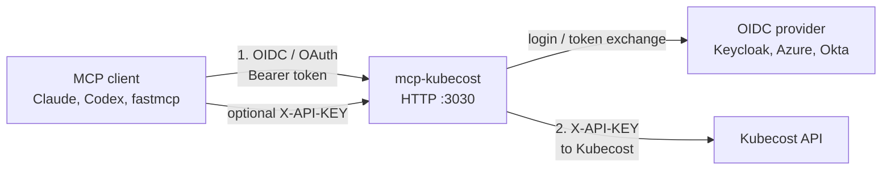
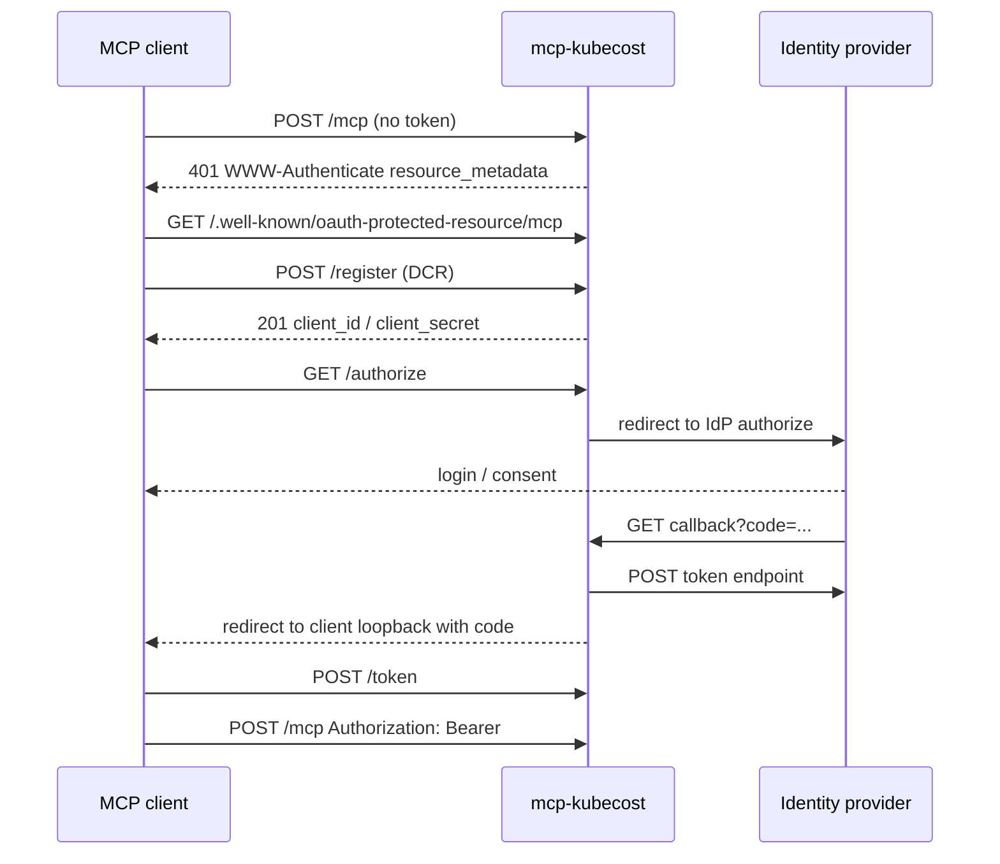
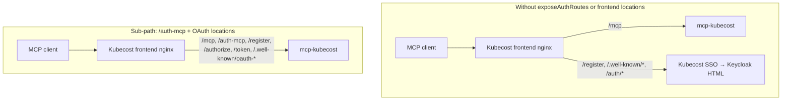

# Authentication and Security<!-- omit in toc -->

This server has two independent auth layers. One protects the **MCP HTTP endpoint** (who may call tools). The other authenticates **outbound calls to Kubecost** (which Kubecost tenant/credential the server uses). They are configured separately and can be combined.

- [Two layers](#two-layers)
- [Authentication options](#authentication-options)
- [Protecting the MCP HTTP endpoint (OIDC)](#protecting-the-mcp-http-endpoint-oidc)
  - [OAuth proxy flow](#oauth-proxy-flow)
  - [Identity provider setup](#identity-provider-setup)
  - [Reusing the Kubecost UI's OIDC client](#reusing-the-kubecost-uis-oidc-client)
  - [Shared Kubecost frontend hostname](#shared-kubecost-frontend-hostname)
  - [Unauthenticated HTTP paths](#unauthenticated-http-paths)
- [Kubecost API keys](#kubecost-api-keys)
- [Configuration](#configuration)
  - [Environment](#environment)
  - [Helm](#helm)
- [Pod hardening and TLS](#pod-hardening-and-tls)
- [STDIO vs HTTP](#stdio-vs-http)
- [Troubleshooting](#troubleshooting)

## Two layers



| Layer                  | Protects                   | Default                 |
| ---------------------- | -------------------------- | ----------------------- |
| MCP HTTP (`AUTH_MODE`) | Who can call `/mcp`        | `none` — open           |
| Kubecost API key       | Outbound Kubecost requests | unset — unauthenticated |

STDIO has no HTTP headers, so MCP OIDC and `REQUIRE_CLIENT_API_KEY` do not apply there. Kubecost can still use `KUBECOST_API_KEY` from the environment.

## Authentication options

`AUTH_MODE` (Helm: `config.authMode`) controls how the MCP HTTP endpoint is protected.

| Mode      | MCP `/mcp`                                                            | Kubecost `X-API-KEY`                                                                              |
| --------- | --------------------------------------------------------------------- | ------------------------------------------------------------------------------------------------- |
| `none`    | No auth — **not permitted when `httproute` or `ingress` is enabled**  | Optional env/header fallback                                                                      |
| `open`    | No auth enforcement; explicitly acknowledged as exposed               | Optional env/header fallback                                                                      |
| `oidc`    | Valid OIDC token via FastMCP `OIDCProxy`                              | Optional env/header fallback                                                                      |
| `api_key` | Incoming `X-API-KEY` required (same as `REQUIRE_CLIENT_API_KEY=true`) | That header is forwarded to Kubecost                                                              |
| `both`    | OIDC token **and** an `X-API-KEY` header (presence check only)        | Header is forwarded; env fallback is not used. Helm fails if `config.kubecostApiKey` is also set. |

`oidc` and `both` require `OIDC_ISSUER_URL`, `OIDC_CLIENT_ID`, `OIDC_CLIENT_SECRET`, and `OIDC_BASE_URL`.

> [!WARNING]
> If `httproute.enabled: true` or `ingress.enabled: true`, `authMode` must **not** be `"none"`.
> Set `authMode` to at least `"open"` to acknowledge the exposure, or to a stricter mode such as `"oidc"` or `"api_key"`.
> Helm will fail pre-install/pre-upgrade if this constraint is violated.
>
> ```yaml
> # values.yaml — minimum required when exposing a route
> config:
>   authMode: "open"   # or oidc / api_key / both
> httpRoute:
>   enabled: true
> ```

## Protecting the MCP HTTP endpoint (OIDC)

When `AUTH_MODE=oidc` (or `both`), the server builds a FastMCP [`OIDCProxy`](https://gofastmcp.com/servers/auth/oidc-proxy). MCP clients speak the MCP OAuth spec to **this server**. This server then talks to the upstream identity provider.

OAuth client registrations and tokens stay in **process memory** (`MemoryStore`). That is required for `readOnlyRootFilesystem`: FastMCP’s default file store mkdirs under `~/.local/share/fastmcp/oauth-proxy/` and fails on a read-only root. Clients re-register after a pod restart. Consent is delegated to the identity provider (`require_authorization_consent="external"`).

### OAuth proxy flow



### Identity provider setup

Register a confidential OAuth client on the provider. The **Valid redirect URI** is this server’s callback, not the MCP client’s localhost URL:

```
{OIDC_BASE_URL}{OIDC_REDIRECT_PATH}
```

`OIDC_REDIRECT_PATH` defaults to `/auth-mcp` — most deployments run this server as a sub-path on an existing Kubecost frontend, so the default targets that case. Example: `OIDC_BASE_URL=https://kubecost.example.com` → add `https://kubecost.example.com/auth-mcp`. Register that path **exactly**; do not append `/callback`.

When this server has a **dedicated hostname** (not a Kubecost sub-path), use `/auth/callback` instead — FastMCP's own `OIDCProxy` default — see [Shared Kubecost frontend hostname](#shared-kubecost-frontend-hostname) for why `/auth-mcp` is otherwise required.

The MCP client’s own redirect (`http://localhost:<port>/callback` or Claude’s `https://claude.ai/api/mcp/auth_callback`) is registered with FastMCP via DCR. Do not put those URLs on the identity provider. This server allowlists those MCP-client redirects (`http://localhost:*`, `http://127.0.0.1:*`, and Claude’s callback) so an unknown `client_id` after a pod restart cannot open-redirect to an arbitrary host. The IdP Valid redirect URI remains only `{OIDC_BASE_URL}{OIDC_REDIRECT_PATH}`.

`OIDC_ISSUER_URL` is the provider’s discovery document, for example: `https://{domain}/.well-known/openid-configuration`.

Optional: `OIDC_AUDIENCE` when the provider issues JWT access tokens for a specific API audience. Do not set it for providers that issue opaque access tokens — those are verified via the `id_token`, whose audience is the OAuth client id. `OIDC_REQUIRED_SCOPES` defaults to `openid,profile`.

Some other providers issue **opaque** access tokens, not JWTs. The server detects that from the token response and verifies the `id_token` instead. JWT access-token issuers (Keycloak, typical Azure/Okta) keep access-token verification. No extra setting is required.

### Reusing the Kubecost UI's OIDC client

Kubecost supports OIDC natively, so a cluster running both Kubecost and this server has two applications needing an OAuth client. One shared client does work if both callbacks are registered on it — but this is not recommended. A second client does not add a second login (the session lives at the identity provider), while a shared one couples the secret, the redirect-URI allowlist, the token audience, and every per-client policy and audit control across a browser UI and an agent-driven API.

Full reasoning, the recommended per-client settings, compensating controls if you must share, and migration steps: [`oidc-client-sharing.md`](oidc-client-sharing.md).

### Shared Kubecost frontend hostname

Use this when the MCP endpoint is a **sub-path on the Kubecost frontend**, for example `https://kubecost.example.com/mcp`, rather than a dedicated MCP hostname.

That nginx typically proxies only `/mcp` and runs `auth_request` on everything else. MCP OAuth then hits Kubecost SSO and the client receives an HTML login page instead of JSON. Kubecost also owns `location /auth` (aggregator `/isAuthenticated`). FastMCP's own default callback `/auth/callback` sits under that prefix, so Keycloak's return would never reach this server if you switched back to it here — which is why `/auth-mcp` is this server's default.

Keep the callback at `/auth-mcp` (the default) — a sibling of `/mcp`, not a child of `/auth`:

|                        | Sub-path on Kubecost                    | Dedicated MCP host                      |
| ---------------------- | --------------------------------------- | --------------------------------------- |
| MCP URL                | `https://kubecost.example.com/mcp`      | `https://mcp.example.com/mcp`           |
| `OIDC_BASE_URL`        | `https://kubecost.example.com`          | `https://mcp.example.com`               |
| `OIDC_REDIRECT_PATH`   | `/auth-mcp` (default)                   | `/auth/callback`                        |
| IdP Valid redirect URI | `https://kubecost.example.com/auth-mcp` | `https://mcp.example.com/auth/callback` |

Helm default: `config.oidc.redirectPath=/auth-mcp`. The IdP URI is `{OIDC_BASE_URL}/auth-mcp` **exactly** — do not append `/callback` (`/auth-mcp/callback` is not a path this server serves).

`/auth-mcp` must be a longer nginx prefix than `/auth`, or `/auth-mcp` is still treated as Kubecost `auth_request`. Proxy these paths to this Service **without** `auth_request` (frontend nginx extra locations, or `config.oidc.exposeAuthRoutes`):

- `/mcp`, `/auth-mcp`
- `/register`, `/authorize`, `/token`, `/consent`
- `/.well-known/oauth-protected-resource`, `/.well-known/oauth-authorization-server`



If you cannot change the Kubecost frontend nginx, set `config.oidc.exposeAuthRoutes=true` so this chart creates an Ingress for those paths on the host from `config.oidc.baseUrl`. Point `config.oidc.authIngress.tlsSecretName` at the existing TLS secret when the host already terminates TLS. Do **not** Ingress-prefix `/auth`.

A dedicated MCP hostname (chart `httpRoute` / `ingress`) avoids this entirely: set `config.oidc.redirectPath=/auth/callback` explicitly (it is no longer the default) and put OAuth routes at `/` on that host.

### Unauthenticated HTTP paths

These FastMCP custom routes are **not** wrapped in OAuth middleware. Kubernetes probes must use them — kubelet cannot present OIDC or `X-API-KEY`.

| Path           | Purpose                                            |
| -------------- | -------------------------------------------------- |
| `GET /health`  | Liveness / readiness (chart default `probes.path`) |
| `GET /version` | Package version                                    |

Uvicorn access logs for `GET /health` are dropped. Do not point probes at `/mcp`.

## Kubecost API keys

By default the server calls Kubecost unauthenticated. That is fine for local port-forwards, or when another layer already authenticates to Kubecost.

When using Kubecost Enterprise with SAML/OIDC/RBAC, Kubecost expects an API key. The key is sent as an **`X-API-KEY` request header**.

The MCP supports both per MCP client keys or a shared key assigned to the MCP server.

| Source                                  | Scope                             |
| --------------------------------------- | --------------------------------- |
| `X-API-KEY` on the incoming MCP request | Per request — HTTP transport only |
| `KUBECOST_API_KEY` environment variable | Process-wide fallback             |

Header wins when both are set. Neither is required; with no key the outbound request is unauthenticated.

`REQUIRE_CLIENT_API_KEY=true` (Helm: `config.requireClientApiKey`) rejects HTTP requests that arrive without the header. The check runs **before** the environment fallback, so a configured `KUBECOST_API_KEY` does not satisfy it. STDIO is never gated.

`AUTH_MODE=both` is the same presence check alongside OIDC: the client must send `X-API-KEY`; the value is forwarded as-is and not validated by the MCP. Helm rejects `config.authMode=both` together with `config.kubecostApiKey` (`value` or `existingSecret`) because that key would never be used over HTTP — set `authMode` to `oidc` for a shared key, or omit `kubecostApiKey`.

## Configuration

Templates: [`.env.example`](../../.env.example) and [`charts/mcp-kubecost/values.yaml`](../../charts/mcp-kubecost/values.yaml). All settings flow through [`get_settings()`](../../src/mcp_kubecost/config/settings.py).

### Environment

| Variable                     | Helm                                 | Role                                                                                           |
| ---------------------------- | ------------------------------------ | ---------------------------------------------------------------------------------------------- |
| `AUTH_MODE`                  | `config.authMode`                    | `none` / `open` / `oidc` / `api_key` / `both`                                                 |
| `OIDC_ISSUER_URL`            | `config.oidc.issuerUrl`              | Provider discovery URL                                                                         |
| `OIDC_CLIENT_ID`             | `config.oidc.clientId` or Secret     | Confidential client id                                                                         |
| `OIDC_CLIENT_SECRET`         | `config.oidc.clientSecret` or Secret | Confidential client secret                                                                     |
| `OIDC_BASE_URL`              | `config.oidc.baseUrl`                | Public URL of this MCP server                                                                  |
| `OIDC_REDIRECT_PATH`         | `config.oidc.redirectPath`           | IdP callback path. Default `/auth-mcp`. Use `/auth/callback` when MCP has a dedicated hostname |
| `OIDC_AUDIENCE`              | `config.oidc.audience`               | Optional token audience (JWT access tokens only; omit for opaque IdPs)                         |
| `OIDC_REQUIRED_SCOPES`       | `config.oidc.requiredScopes`         | Default `openid,profile`                                                                       |
| `KUBECOST_API_KEY`           | `config.kubecostApiKey`              | Fallback key sent to Kubecost                                                                  |
| `REQUIRE_CLIENT_API_KEY`     | `config.requireClientApiKey`         | Require inbound `X-API-KEY` on HTTP                                                            |
| `KUBECOST_SSL_VERIFY`        | `config.ssl.verify`                  | TLS verify for Kubecost                                                                        |
| `SSL_CA_BUNDLE`              | `config.ssl.caBundle`                | Custom CA path (implies verify)                                                                |
| `FASTMCP_HTTP_ALLOWED_HOSTS` | `config.fastmcpHttpAllowedHosts`     | JSON array of allowed `Host` headers; empty disables                                           |

OIDC client credentials in Helm: set `config.oidc.existingSecret` (keys `OIDC_CLIENT_ID` and `OIDC_CLIENT_SECRET`) or `clientId` / `clientSecret` (the chart will mint a Secret).

### Helm

```bash
helm upgrade --install mcp-kubecost ./charts/mcp-kubecost \
  --namespace mcp-kubecost --create-namespace \
  --set config.kubecostBaseUrl=https://kubecost.example.com \
  --set config.kubecostApiKey.existingSecret=kubecost-api-key \
  --set config.authMode=oidc \
  --set config.oidc.issuerUrl=https://keycloak.example.com/realms/kubecost/.well-known/openid-configuration \
  --set config.oidc.baseUrl=https://mcp.example.com \
  --set config.oidc.existingSecret=mcp-oidc \
  --set config.oidc.exposeAuthRoutes=true \
  --set config.oidc.authIngress.tlsSecretName=mcp-tls
```

That example is the shared-key layout (`authMode: oidc` plus `kubecostApiKey`). Helm fails if you set `authMode: both` and also supply `config.kubecostApiKey`.

When MCP has a dedicated hostname, set `config.oidc.redirectPath=/auth/callback` and register that URI on the IdP. `exposeAuthRoutes` is off by default; turn it on only if the frontend nginx does not already proxy the OAuth paths.

## Pod hardening and TLS

The chart defaults are meant for a locked-down runtime:

- non-root UID/GID `65532`, `runAsNonRoot`, `RuntimeDefault` seccomp
- `readOnlyRootFilesystem`, all capabilities dropped, no privilege escalation
- `automountServiceAccountToken: false`
- OIDC state in memory so the root filesystem can stay read-only

For a custom CA, put the cert in a Secret and set `config.ssl.caBundle.existingSecret` / `key`. The chart mounts it read-only and sets `SSL_CA_BUNDLE`.

## STDIO vs HTTP

|                     | STDIO                  | HTTP                         |
| ------------------- | ---------------------- | ---------------------------- |
| Typical use         | Local IDE / desktop    | Shared or Kubernetes service |
| MCP OIDC            | Not used               | `AUTH_MODE=oidc` or `both`   |
| Inbound `X-API-KEY` | Cannot send headers    | Optional or required         |
| Kubecost key        | `KUBECOST_API_KEY` env | Header, then env             |

Local HTTP: `uv run fastmcp run fastmcp-http.json` (port 3030).

## Troubleshooting

**MCP client panics parsing HTML on `/register` or `/.well-known/...`**
Kubecost frontend SSO intercepted the OAuth path. Enable `config.oidc.exposeAuthRoutes`, or give the MCP server its own hostname.

**Keycloak `invalid_redirect_uri`**
Add `{OIDC_BASE_URL}{OIDC_REDIRECT_PATH}` to the client’s Valid redirect URIs — the value in the Keycloak error URL’s `redirect_uri=` query param. Default is `{OIDC_BASE_URL}/auth-mcp` with no extra `/callback`. Dedicated hostname: `{OIDC_BASE_URL}/auth/callback`. Do not add the MCP client’s localhost or Claude callback there.

**Pod crash on start with read-only root / `mkdir` under `.local/share/fastmcp`**
OIDC file storage tried to write to disk. Current builds use `MemoryStore`; rebuild/redeploy if the image predates that change.

**Probes failing with 401**
`probes.path` must be `/health`, not `/mcp`.

**OIDC init error about HTML discovery metadata**
`OIDC_ISSUER_URL` must be the provider’s `/.well-known/openid-configuration` JSON URL, not a login page and not this server’s `/mcp` URL.

**Helm fails: `authMode=both cannot be combined with config.kubecostApiKey`**
`both` requires every HTTP caller to send `X-API-KEY`, so a Helm key is unused. Set `config.authMode=oidc` to use the shared key, or omit `config.kubecostApiKey`.

**Helm fails: `ERROR: authMode must be configured before enabling httproute or ingress`**
`httpRoute.enabled` or `ingress.enabled` is `true` but `config.authMode` is `"none"`. Set `config.authMode` to `"open"` (no auth, explicitly acknowledged) or a stricter mode (`oidc`, `api_key`, `both`). Leaving an exposed route with `authMode: none` is not permitted.

**Login succeeds but `/mcp` returns `invalid_token` / tools never appear**
Confirm the IdP returned an `id_token` (request `openid`). Opaque access tokens are verified via that `id_token` automatically. If `OIDC_AUDIENCE` is set for an opaque IdP, remove it — the `id_token` audience is the OAuth client id. Check logs for `Upstream token validation failed` or `no id_token was in the token response`.
