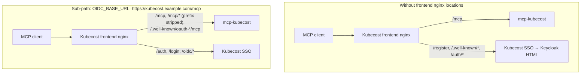

# Authentication — Technical Reference<!-- omit in toc -->

This page is the full technical reference for both auth layers. For a high-level overview of available modes and which to choose, see [README.md](README.md).

- [Protecting the MCP HTTP endpoint (OIDC)](#protecting-the-mcp-http-endpoint-oidc)
  - [Identity provider setup](#identity-provider-setup)
  - [Reusing the Kubecost UI's OIDC client](#reusing-the-kubecost-uis-oidc-client)
  - [Shared Kubecost frontend hostname](#shared-kubecost-frontend-hostname)
  - [Unauthenticated HTTP paths](#unauthenticated-http-paths)
- [Configuration](#configuration)
  - [Environment](#environment)
  - [Helm](#helm)
  - [Optional enterprise client lockdown](#optional-enterprise-client-lockdown)
- [Pod hardening and TLS](#pod-hardening-and-tls)
- [STDIO vs HTTP](#stdio-vs-http)
- [Troubleshooting](#troubleshooting)

## Protecting the MCP HTTP endpoint (OIDC)

When `AUTH_MODE=oidc`, the server builds a FastMCP [`OIDCProxy`](https://gofastmcp.com/servers/auth/oidc-proxy). MCP clients speak the MCP OAuth spec to **this server**. This server then talks to the upstream identity provider.

### Identity provider setup

`OIDC_REDIRECT_PATH` defaults to `/auth-mcp` — most deployments run this server as a sub-path on an existing Kubecost frontend, so the default targets that case. Example: `OIDC_BASE_URL=https://kubecost.example.com/mcp` → add `https://kubecost.example.com/mcp/auth-mcp`. Register that path **exactly**; do not append `/callback`. The redirect URI always includes the path prefix from `OIDC_BASE_URL`, so changing that prefix means re-registering the URI at the IdP.

When this server has a **dedicated hostname** (not a Kubecost sub-path), use `/auth/callback` instead — see [Shared Kubecost frontend hostname](#shared-kubecost-frontend-hostname) for why `/auth-mcp` is otherwise required.

The MCP client's own redirect (`http://localhost:<port>/callback`, Claude's `https://claude.ai/api/mcp/auth_callback`, or ChatGPT's `https://chatgpt.com/connector/oauth/{callback_id}` / `https://chatgpt.com/connector_platform_oauth_redirect`) is registered with FastMCP through DCR or resolved from its Client ID Metadata Document. Do not put those URLs on the identity provider. By default, this server uses FastMCP's Open, DCR/CIMD-compatible redirect validation: ordinary safe callbacks are accepted while unsafe browser schemes are rejected. Persisted DCR registrations survive pod recreation in the PVC-backed FileTreeStore; CIMD clients are resolved from their metadata documents.

For an enterprise Restricted posture, set `OIDC_ALLOWED_CLIENT_REDIRECT_URIS` to a JSON array of approved FastMCP redirect patterns (Helm: `config.oidc.allowedClientRedirectUris`). Only listed callbacks can then register. Start Open, inspect `Client registered with redirect_uri` server logs to identify the callbacks your clients actually use, configure those patterns, and test every supported client. An unset or blank setting remains Open; `[]` intentionally denies all client redirects. The IdP Valid redirect URI remains only `{OIDC_BASE_URL}{OIDC_REDIRECT_PATH}`. See OpenAI's [authentication guide](https://developers.openai.com/plugins/build/auth#redirect-url) for the current ChatGPT callback forms.

FastMCP displays consent once per MCP client and remembers the decision in a
signed browser cookie. OAuth registrations, authorization codes, and tokens are
stored by the built-in FileTreeStore through a Fernet encryption wrapper. The
Helm chart persists that directory on a PVC when `config.authMode` is `oidc`
(`persistence.enabled` defaults to auto). Keep the signing and encryption
keys stable across upgrades; rotating the encryption key without a
migration invalidates previously stored state.

DCR registrations are **idempotent**: this server derives the `client_id` from
the registration metadata (redirect URIs, client name, grant and response types,
scope, auth method), keyed on `OIDC_STORAGE_ENCRYPTION_KEY`, so a client that
registers the same metadata twice gets one identity back. The MCP SDK otherwise
mints a fresh `uuid4()` per `/register`, and a client opening two connections at
once ends up with two identities sharing a single loopback callback port — the
authorization code minted for one is then redeemed by the other, which FastMCP
rejects as a client ID mismatch. The browser shows "Authentication complete"
because the client's loopback page renders on receipt of the code, while the
back-channel `POST /token` returns 401 and the session never establishes.
Because the derived id is keyed on the storage encryption key, an ephemeral key
also re-randomizes these ids — one more reason to set it explicitly.

`OIDC_ISSUER_URL` is the provider's discovery document, for example: `https://{domain}/.well-known/openid-configuration`.

Optional: `OIDC_AUDIENCE` when the provider issues JWT access tokens for a specific API audience. Do not set it for providers that issue opaque access tokens — those are verified via the `id_token`, whose audience is the OAuth client id. `OIDC_REQUIRED_SCOPES` defaults to `openid,profile`.

Some other providers issue **opaque** access tokens, not JWTs. The server detects that from the token response and verifies the `id_token` instead. JWT access-token issuers (Keycloak, typical Azure/Okta) keep access-token verification. No extra setting is required.

### Reusing the Kubecost UI's OIDC client

Kubecost supports OIDC natively, so a cluster running both Kubecost and this server has two applications needing an OAuth client. One shared client does work if both callbacks are registered on it — but this is not recommended. A second client does not add a second login (the session lives at the identity provider), while a shared one couples the secret, the redirect-URI allowlist, the token audience, and every per-client policy and audit control across a browser UI and an agent-driven API.

Full reasoning, the recommended per-client settings, compensating controls if you must share, and migration steps: [`oidc-client-sharing.md`](oidc-client-sharing.md).

### Shared Kubecost frontend hostname

Use this when the MCP endpoint is a **sub-path on the Kubecost frontend**, for example `https://kubecost.example.com/mcp`, rather than a dedicated MCP hostname.

That nginx typically proxies only `/mcp` and runs `auth_request` on everything else. MCP OAuth then hits Kubecost SSO and the client receives an HTML login page instead of JSON. Kubecost also owns `location /auth` (aggregator `/isAuthenticated`). FastMCP's own default callback `/auth/callback` sits under that prefix, so Keycloak's return would never reach this server if you switched back to it here — which is why `/auth-mcp` is this server's default.

On a shared Kubecost hostname, give `OIDC_BASE_URL` a **path prefix**. FastMCP
builds its advertised OAuth endpoints from that base URL, so the whole OAuth
surface moves under the prefix and nothing claims a bare root path on a host
that Kubecost SSO also owns:

|                        | Sub-path on Kubecost (recommended)          | Dedicated MCP host                      |
| ---------------------- | ------------------------------------------- | --------------------------------------- |
| MCP URL                | `https://kubecost.example.com/mcp`          | `https://mcp.example.com/mcp`           |
| `OIDC_BASE_URL`        | `https://kubecost.example.com/mcp`          | `https://mcp.example.com`               |
| `MCP_HTTP_PATH`        | `/` (derived; `config.http.path`)           | `/mcp` (default)                        |
| `OIDC_REDIRECT_PATH`   | `/auth-mcp` (default)                       | `/auth/callback`                        |
| IdP Valid redirect URI | `https://kubecost.example.com/mcp/auth-mcp` | `https://mcp.example.com/auth/callback` |

The IdP URI is `{OIDC_BASE_URL}{OIDC_REDIRECT_PATH}` **exactly** — do not append
`/callback` (`/auth-mcp/callback` is not a path this server serves).

With a path-prefixed `OIDC_BASE_URL`, the frontend nginx strips the prefix and
this server serves everything at its root, so `config.http.path` must be `/`
(this chart derives that for you from `config.oidc.baseUrl`). The prefix-stripping
locations belong to whoever owns the Kubecost frontend nginx. The paths that
must reach this Service **without** `auth_request`, with the prefix stripped:

- `/mcp` and `/mcp/*` — the MCP endpoint plus `/mcp/authorize`, `/mcp/token`, `/mcp/register`, `/mcp/consent`, `/mcp/auth-mcp`
- `/.well-known/oauth-protected-resource/mcp/` — RFC 9728; clients derive it from the resource identifier, so it can only live at the host root. Note the **trailing slash**: with `MCP_HTTP_PATH=/` the resource identifier is `https://kubecost.example.com/mcp/`, and FastMCP registers the metadata route to match. Use a prefix match (`location /.well-known/oauth-protected-resource/mcp`), not an exact `location =`, so both spellings resolve.
- `/.well-known/oauth-authorization-server/mcp` — RFC 8414 discovery for issuer `.../mcp`, rewritten to `/.well-known/oauth-authorization-server` because FastMCP registers that route at this server's root

An nginx sketch for the first two, on the Kubecost frontend:

```nginx
# Host and port follow the chart's Service: {release}-mcp-kubecost on service.port (default 3030).
location /mcp/ {
    proxy_pass http://mcp-kubecost.mcp-kubecost.svc.cluster.local:3030/;  # trailing / strips the prefix
    proxy_set_header Host $host;
    proxy_set_header X-Forwarded-Proto $scheme;
}
location /.well-known/oauth-protected-resource/mcp {
    proxy_pass http://mcp-kubecost.mcp-kubecost.svc.cluster.local:3030;
}
```

Leaving `OIDC_BASE_URL` at a host root keeps the older layout, where `/authorize`,
`/token`, `/register` and `/.well-known/oauth-authorization-server` are claimed at
the root of the shared host and `/auth-mcp` must stay a longer nginx prefix than
Kubecost's `/auth`, or it is still treated as `auth_request`.



If you cannot change the Kubecost frontend nginx, the cleanest resolution is to give the MCP server its own hostname via `httpRoute` or `ingress`, set `config.oidc.baseUrl` to that root hostname (no path prefix), and set `config.oidc.redirectPath=/auth/callback`.

### Unauthenticated HTTP paths

These FastMCP custom routes are **not** wrapped in OAuth middleware. Kubernetes probes must use them — kubelet cannot present OIDC or `X-API-KEY`.

| Path           | Purpose                                            |
| -------------- | -------------------------------------------------- |
| `GET /health`  | Liveness / readiness (chart default `probes.path`) |
| `GET /version` | Package version                                    |

Uvicorn access logs for `GET /health` are dropped. Do not point probes at `/mcp`.

## Configuration

Templates: [`.env.example`](../../.env.example) and [`charts/mcp-kubecost/values.yaml`](../../charts/mcp-kubecost/values.yaml). All settings flow through [`get_settings()`](../../src/mcp_kubecost/config/settings.py).

### Environment

| Variable                              | Helm                                                    | Role                                                                                                                                                                                                                                                                                                                                                     |
| ------------------------------------- | ------------------------------------------------------- | -------------------------------------------------------------------------------------------------------------------------------------------------------------------------------------------------------------------------------------------------------------------------------------------------------------------------------------------------------- |
| `AUTH_MODE`                           | `config.authMode`                                       | `none` / `open` / `oidc` / `api_key`                                                                                                                                                                                                                                                                                                                     |
| `OIDC_ISSUER_URL`                     | `config.oidc.issuerUrl`                                 | Provider discovery URL                                                                                                                                                                                                                                                                                                                                   |
| `OIDC_CLIENT_ID`                      | `config.oidc.clientId` or Secret                        | Confidential client id                                                                                                                                                                                                                                                                                                                                   |
| `OIDC_CLIENT_SECRET`                  | `config.oidc.clientSecret` or Secret                    | Confidential client secret                                                                                                                                                                                                                                                                                                                               |
| `OIDC_BASE_URL`                       | `config.oidc.baseUrl`                                   | Public URL of this MCP server. A path prefix (`https://host/mcp`) moves every OAuth endpoint under it                                                                                                                                                                                                                                                    |
| `MCP_HTTP_PATH`                       | `config.http.path`                                      | Route the MCP endpoint is served on. Derived: `/` when `OIDC_BASE_URL` has a path prefix, else `/mcp`. Read by the container entrypoint, not `get_settings()` — see note below                                                                                                                                                                           |
| `OIDC_REDIRECT_PATH`                  | `config.oidc.redirectPath`                              | IdP callback path. Default `/auth-mcp`. Use `/auth/callback` when MCP has a dedicated hostname                                                                                                                                                                                                                                                           |
| `OIDC_AUDIENCE`                       | `config.oidc.audience`                                  | Optional token audience (JWT access tokens only; omit for opaque IdPs)                                                                                                                                                                                                                                                                                   |
| `OIDC_REQUIRED_SCOPES`                | `config.oidc.requiredScopes`                            | Default `openid,profile`                                                                                                                                                                                                                                                                                                                                 |
| `OIDC_ALLOWED_CLIENT_REDIRECT_URIS`   | `config.oidc.allowedClientRedirectUris`                 | Optional JSON array of allowed downstream MCP-client callback patterns. Unset/blank is Open; `[]` denies all callbacks. This is not the IdP callback allowlist.                                                                                                                                                                                          |
| `OIDC_STORAGE_PATH`                   | fixed by the chart                                      | Built-in FileTreeStore directory. Default `/var/lib/mcp-kubecost/oauth`; Helm mounts its mandatory PVC at the parent directory. Must be a nested absolute path with no `..` segments — the server deletes this directory when the storage key is ephemeral, so `/` and top-level directories are rejected                                                |
| `OIDC_JWT_SIGNING_KEY`                | `config.oidc.jwtSigningKey` or Secret                   | **Optional.** Stable random key, at least 32 characters, used to sign MCP-side OAuth tokens. If omitted, a secure ephemeral key is generated at startup — set this explicitly in production to ensure token consistency across restarts. Generating this key does **not** wipe stored OAuth state; only the storage key does.                            |
| `OIDC_STORAGE_ENCRYPTION_KEY`         | `config.oidc.storageEncryptionKey` or Secret            | **Optional.** URL-safe base64 Fernet key used to encrypt OAuth state before FileTreeStore persistence. If omitted, a secure ephemeral key is generated at startup and existing storage is wiped, because state written under the previous key can no longer be decrypted — set this explicitly in production to preserve OAuth sessions across restarts. |
| `KUBECOST_API_KEY`                    | `config.kubecostApiKey` (`.value` or `.existingSecret`) | Fallback key sent to Kubecost. Prefer `.existingSecret` naming a pre-created Secret (`kubectl create secret generic <name> --from-literal=KUBECOST_API_KEY=<key>`, or provision via CI/CD); `.value` inline makes the chart mint the Secret. `.key` sets the Secret key, default `KUBECOST_API_KEY`                                                      |
| `REQUIRE_CLIENT_API_KEY`              | `config.requireClientApiKey`                            | Require inbound `X-API-KEY` on HTTP                                                                                                                                                                                                                                                                                                                      |
| `KUBECOST_SSL_VERIFY`                 | `config.ssl.verify`                                     | TLS verify for Kubecost                                                                                                                                                                                                                                                                                                                                  |
| `SSL_CA_BUNDLE`                       | `config.ssl.caBundle`                                   | Custom CA path (implies verify)                                                                                                                                                                                                                                                                                                                          |
| `FASTMCP_HTTP_ALLOWED_HOSTS`          | `config.fastmcpHttpAllowedHosts`                        | JSON array of allowed `Host` headers; empty disables                                                                                                                                                                                                                                                                                                     |
| `FASTMCP_HTTP_ALLOWED_ORIGINS`        | `config.fastmcpHttpAllowedOrigins`                      | JSON array of browser origins trusted by the Host/Origin guard                                                                                                                                                                                                                                                                                           |
| `FASTMCP_HTTP_HOST_ORIGIN_PROTECTION` | `config.fastmcpHttpHostOriginProtection`                | `auto` by default; set `true` with explicit allowlists for strict validation                                                                                                                                                                                                                                                                             |
| `MCP_RATE_LIMIT_REQUESTS_PER_SECOND`  | `config.rateLimitRequestsPerSecond`                     | Sustained MCP request rate per pod; default `10`                                                                                                                                                                                                                                                                                                         |
| `MCP_RATE_LIMIT_BURST_CAPACITY`       | `config.rateLimitBurstCapacity`                         | Token-bucket burst capacity; default `20`                                                                                                                                                                                                                                                                                                                |
| `MCP_MAX_CONCURRENT_TOOL_CALLS`       | `config.maxConcurrentToolCalls`                         | Simultaneous tool executions; default `10`                                                                                                                                                                                                                                                                                                               |

`MCP_HTTP_PATH` is the one entry in that table not read through `get_settings()`. It shapes the `fastmcp run --path` argv, so [`otel_entrypoint.py`](../../src/mcp_kubecost/otel_entrypoint.py) reads it before the server process exists. The entrypoint calls `load_dotenv()` itself, so `.env` works; but running `uv run fastmcp run config/fastmcp-http.json` bypasses the entrypoint entirely and ignores the variable — pass `--path` on the command line for that case.

OIDC secrets in Helm: set `config.oidc.existingSecret` with keys
`OIDC_CLIENT_ID`, `OIDC_CLIENT_SECRET`, `OIDC_JWT_SIGNING_KEY`, and
`OIDC_STORAGE_ENCRYPTION_KEY`; or set all four
inline values and the chart will mint a Secret. The Deployment defaults to one
replica with `Recreate` (`deployment.replicas`, `deployment.strategy`). Multiple
replicas are rejected while OIDC persistence is on — FileTreeStore is
single-writer. For HA, put an MCP gateway or OAuth proxy in front, keep
`authMode` off `oidc`, and set `persistence.enabled: false`. When a PVC is
created it is `ReadWriteOnce` and `OIDC_STORAGE_PATH` is fixed to
`/var/lib/mcp-kubecost/oauth`; tune provisioning with `persistence.*`.

### Helm

```bash
helm upgrade --install mcp-kubecost ./charts/mcp-kubecost \
  --namespace mcp-kubecost --create-namespace \
  --set config.kubecostApiBaseUrl=https://kubecost.example.com \
  --set config.kubecostApiPort=443 \
  --set config.kubecostApiBasePath=/model \
  --set config.kubecostApiKey.existingSecret=kubecost-api-key \
  --set config.authMode=oidc \
  --set config.oidc.issuerUrl=https://keycloak.example.com/realms/kubecost/.well-known/openid-configuration \
  --set config.oidc.baseUrl=https://mcp.example.com \
  --set config.oidc.existingSecret=mcp-oidc
```

That example is the dedicated-hostname layout (`authMode: oidc` with a root `baseUrl`). Set `config.oidc.redirectPath=/auth/callback` and register that URI on the IdP. To also require each caller to send `X-API-KEY`, set `config.requireClientApiKey: true`.

### Optional enterprise client lockdown

Leave `config.oidc.allowedClientRedirectUris` empty for the default Open
posture. To restrict downstream MCP clients after reviewing
`Client registered with redirect_uri` logs, set it to a JSON-array string:

```yaml
config:
  oidc:
    allowedClientRedirectUris: >-
      ["http://localhost:*", "http://127.0.0.1:*", "https://claude.ai/api/mcp/auth_callback", "https://chatgpt.com/connector/oauth/*", "https://chatgpt.com/connector_platform_oauth_redirect"]
```

This setting constrains MCP-client callbacks only. Do not add those values to
the identity provider; its valid redirect URI remains
`{OIDC_BASE_URL}{OIDC_REDIRECT_PATH}`. The exact list is deployment-specific:
add and test each client your organization supports. Set `[]` only to deny all
client redirects deliberately.

## Pod hardening and TLS

The chart defaults are meant for a locked-down runtime:

- non-root UID/GID `65532`, `runAsNonRoot`, `RuntimeDefault` seccomp
- `readOnlyRootFilesystem`, all capabilities dropped, no privilege escalation
- `automountServiceAccountToken: false`
- encrypted OIDC state on a dedicated PVC while the root filesystem stays read-only

For a custom CA, put the cert in a Secret and set `config.ssl.caBundle.existingSecret` / `key`. The chart mounts it read-only and sets `SSL_CA_BUNDLE`.

## STDIO vs HTTP

|                     | STDIO                  | HTTP                         |
| ------------------- | ---------------------- | ---------------------------- |
| Typical use         | Local IDE / desktop    | Shared or Kubernetes service |
| MCP OIDC            | Not used               | `AUTH_MODE=oidc`             |
| Inbound `X-API-KEY` | Cannot send headers    | Optional or required         |
| Kubecost key        | `KUBECOST_API_KEY` env | Header, then env             |

Local HTTP: `uv run fastmcp run config/fastmcp-http.json` (port 3030).

## Troubleshooting

**MCP client panics parsing HTML on `/register` or `/.well-known/...`**
Kubecost frontend SSO intercepted the OAuth path. Give `config.oidc.baseUrl` a path prefix (`https://kubecost.example.com/mcp`) so OAuth paths move under `/mcp/` (and update the frontend nginx to proxy them), or give the MCP server its own dedicated hostname.

**Keycloak `invalid_redirect_uri`**
Add `{OIDC_BASE_URL}{OIDC_REDIRECT_PATH}` to the client's Valid redirect URIs — the value in the Keycloak error URL's `redirect_uri=` query param. Default is `{OIDC_BASE_URL}/auth-mcp` with no extra `/callback`. Dedicated hostname: `{OIDC_BASE_URL}/auth/callback`. Do not add MCP-client callbacks such as localhost, Claude, or ChatGPT there.

**Pod cannot create or write `/var/lib/mcp-kubecost/oauth`**
Confirm the chart-created PVC is Bound and the pod security context was not
overridden without an equivalent writable `fsGroup`. On OpenShift, enable the
parent chart's OpenShift platform settings so the SCC assigns the UID/GID.

**Probes failing with 401**
`probes.path` must be `/health`, not `/mcp`.

**OIDC init error about HTML discovery metadata**
`OIDC_ISSUER_URL` must be the provider's `/.well-known/openid-configuration` JSON URL, not a login page and not this server's `/mcp` URL.

**Helm fails: `ERROR: authMode must be configured before enabling httproute or ingress`**
`httpRoute.enabled` or `ingress.enabled` is `true` but `config.authMode` is `"none"`. Set `config.authMode` to `"open"` (no auth, explicitly acknowledged) or a stricter mode (`oidc`, `api_key`). Leaving an exposed route with `authMode: none` is not permitted.

**Login succeeds but `/mcp` returns `invalid_token` / tools never appear**
Confirm the IdP returned an `id_token` (request `openid`). Opaque access tokens are verified via that `id_token` automatically. If `OIDC_AUDIENCE` is set for an opaque IdP, remove it — the `id_token` audience is the OAuth client id. Check logs for `Upstream token validation failed` or `no id_token was in the token response`.
