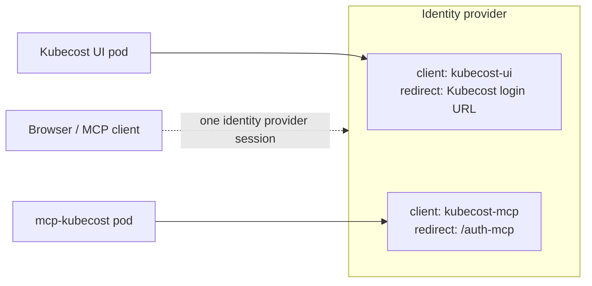

# Reusing the Kubecost UI's OIDC client<!-- omit in toc -->

Kubecost supports OIDC single sign-on natively, and this MCP server has its own OIDC support (FastMCP's `OIDCProxy`). When you run the MCP as an additional pod next to Kubecost, both need an OAuth client on your identity provider. This page answers whether that can be the _same_ client.

- [Short answer](#short-answer)
- [Does one shared client work at all?](#does-one-shared-client-work-at-all)
- [Two clients does not mean two logins](#two-clients-does-not-mean-two-logins)
- [What a shared client costs you](#what-a-shared-client-costs-you)
  - [One secret, two blast radii](#one-secret-two-blast-radii)
  - [One redirect-URI allowlist for both apps](#one-redirect-uri-allowlist-for-both-apps)
  - [One audience for two very different surfaces](#one-audience-for-two-very-different-surfaces)
  - [Everything the identity provider scopes per client](#everything-the-identity-provider-scopes-per-client)
- [What a shared client does not break](#what-a-shared-client-does-not-break)
- [Recommended setup: one client per app](#recommended-setup-one-client-per-app)
- [If you have to share one client](#if-you-have-to-share-one-client)
- [Migrating from a shared client to a dedicated one](#migrating-from-a-shared-client-to-a-dedicated-one)
- [Related](#related)

## Short answer

> [!IMPORTANT]
> Register a **separate OAuth client** for the MCP server. Sharing one client with the Kubecost UI does work, but the setup effort you save is a one-time admin task, while the coupling you accept is permanent.

Four things get worse when both apps share a client:

- **One secret protects both.** A leak from either compromises both, and rotation becomes a coordinated two-app change across two namespaces.
- **One redirect-URI allowlist covers both.** Every URI registered for either app becomes a valid redirect target for the other.
- **One audience for two very different surfaces.** A browser UI and an agent-driven API pod become indistinguishable to the identity provider.
- **No per-client policy or audit.** Token lifetimes, roles, consent, step-up authentication, and identity provider event logs are all scoped per client.

None of these is an immediate exploit. Together they mean you cannot answer "who used the MCP?" or "may this user use the MCP but not the UI?" — and you cannot fix that later without doing the client split anyway.

## Does one shared client work at all?

Yes, and that is why it looks tempting. Redirect URIs are a per-client allowlist, so a single client with both callbacks registered will complete login for both apps:

| App            | Redirect URI on the identity provider                                        |
| -------------- | ---------------------------------------------------------------------------- |
| Kubecost UI    | Whatever you configured as Kubecost's OIDC redirect URL                      |
| `mcp-kubecost` | `{OIDC_BASE_URL}{OIDC_REDIRECT_PATH}` — by default `https://<host>/auth-mcp` |

The identity provider has no concept of "which application is asking" beyond `client_id`, so both flows are equally valid to it. Working is not the same as separated.

## Two clients does not mean two logins

This is the important correction to the friction argument: **the user-facing friction you are trying to avoid does not exist.**

A user's sign-in session lives at the identity provider, in a cookie on the provider's own domain — not at the client application. When someone who is already signed in to the Kubecost UI connects an MCP client, the authorize request for the second OAuth client hits that existing session and returns immediately. No second password prompt, no second MFA challenge.

The only friction a second client adds is administrative:

1. Create one more client in the identity provider.
2. Store one more secret.

This server delegates consent to the identity provider (`require_authorization_consent="external"`), so if your provider forces a per-client consent screen, users see it once for the new client. Turn consent off on the client if that matters — it is a per-client setting, which is itself an argument for having a second client.

## What a shared client costs you

### One secret, two blast radii

The same `client_secret` fronts a browser UI and a pod that serves an LLM. A leak from either compromises both, and every rotation is a coordinated change to two workloads.

In Kubernetes this is worse than it sounds. If Kubecost and `mcp-kubecost` are in different namespaces (this chart's install example creates its own), you have to copy the secret across a namespace boundary — multiplying the number of places it exists and the number of service accounts and operators that can read it.

### One redirect-URI allowlist for both apps

Your provider validates redirect URIs per _client_, not per application. With one client, an authorization request can name your `client_id` and the _other_ app's callback, landing an authorization code at an application that holds the same secret and can redeem it. PKCE makes direct code theft hard, but you have created a cross-application code-injection and session-fixation surface that separate clients remove entirely.

It also creates invisible coupling: a wildcard added to the Kubecost entries later (`https://kubecost.example.com/*`) silently widens what the MCP server will accept, and the reverse. Neither app's own configuration shows this — it exists only in the identity provider.

### One audience for two very different surfaces

The token audience is derived from the client, so with one client nothing in a token distinguishes "minted for the Kubecost UI" from "minted for the MCP". This server makes that concrete: when the provider issues opaque access tokens, it verifies the `id_token`, whose audience is the OAuth client ID.

The direction that matters is MCP toward Kubecost. The MCP pod holds live upstream access and refresh tokens in memory for each connected user. If those tokens carry the same audience the Kubecost UI accepts, they are also usable directly against Kubecost as that user. Separate clients let Kubecost reject them.

### Everything the identity provider scopes per client

| Per-client control                                 | Why it matters here                                                                                                |
| -------------------------------------------------- | ------------------------------------------------------------------------------------------------------------------ |
| Access and refresh token lifetimes, offline access | An unattended agent wants long-lived refresh; a browser UI wants short. Sharing forces the looser setting on both. |
| Client roles, audience and claim mappers           | No way to grant "may use the MCP" separately from "may view Kubecost".                                             |
| Consent requirement                                | Cannot require explicit consent for the agent surface only.                                                        |
| Authentication flow overrides, step-up / ACR       | Cannot demand stronger authentication for the tool-calling surface.                                                |
| Event log attribution                              | Provider events key on `client_id`, so the logs cannot tell you who used the MCP.                                  |

Weigh that last row heavily. This server is read-only, but it surfaces organization-wide cost and infrastructure topology to an LLM. "Which people drove agent queries against this, and when" is a question you will eventually be asked, and a shared `client_id` makes the identity provider unable to answer it.

## What a shared client does not break

Two failure modes people expect here do not actually apply:

- **A Kubecost UI token cannot be replayed against `/mcp`.** FastMCP's OAuth proxy mints its own MCP-side tokens, scoped to the MCP resource URL, and only validates upstream provider tokens inside the token exchange. A bearer token lifted from a Kubecost browser session is not accepted at `/mcp`.
- **Sessions stay independent.** Signing out of one app, or a pod restart, does not sign the user out of the other. Sessions live at the identity provider.

So the honest risk is not "tokens become interchangeable everywhere". It is the credential, redirect, and policy coupling above.

## Recommended setup: one client per app



Create a second confidential client for the MCP with these settings:

| Setting                 | Value                                                                                |
| ----------------------- | ------------------------------------------------------------------------------------ |
| Client authentication   | On — this is a confidential client with a secret                                     |
| Authorization code flow | Enabled (standard flow)                                                              |
| Valid redirect URIs     | `{config.oidc.baseUrl}{onfig.oidc.redirectPath}`                                     |
| Scopes                  | Must include `openid` and `profile` (the `OIDC_REQUIRED_SCOPES` default)             |
| Consent                 | Off, unless you specifically want a consent screen for agent access                  |

Install the mcp-kubecost chart at a Secret holding only the MCP client's credentials:

```bash
kubectl create secret generic mcp-oidc \
  --namespace mcp-kubecost \
  --from-literal=OIDC_CLIENT_ID=kubecost-mcp \
  --from-literal=OIDC_CLIENT_SECRET="$OIDC_CLIENT_SECRET"

helm upgrade --install mcp-kubecost \
  --repo https://kubecost.github.io/mcp-kubecost mcp-kubecost \
  --namespace mcp-kubecost --create-namespace \
  --set config.kubecostApiBaseUrl=https://kubecost.example.com \
  --set config.kubecostApiPort=443 \
  --set config.kubecostApiBasePath=/model \
  --set config.authMode=oidc \
  --set config.oidc.issuerUrl=https://keycloak.example.com/realms/kubecost/.well-known/openid-configuration \
  --set config.oidc.baseUrl=https://mcp.example.com \
  --set config.oidc.redirectPath=/auth/callback \
  --set config.oidc.existingSecret=mcp-oidc
```

Three things not to do:

- Do not add the MCP callback to the Kubecost client, or Kubecost's callback to the MCP client. That recreates the shared allowlist without sharing credentials.
- Do not register MCP client callbacks (`http://localhost:<port>/callback`, `https://claude.ai/api/mcp/auth_callback`) on the identity provider. Those belong to this server's dynamic client registration.
- Do not reuse the Kubecost API key as the OIDC secret, or vice versa. They are separate layers — see [`README.md`](README.md).

## If you have to share one client

There are legitimate reasons: an identity provider you do not own, where a new client registration is a multi-week ticket. Treat it as a documented, time-boxed exception and compensate:

- Keep both apps at the same trust tier and the same user population. The moment you need different authorization for the MCP than for the UI, the shared client stops working and you migrate anyway.
- Exact redirect URIs only, on both apps' entries. No wildcard hosts, no wildcard paths. This server's default `/auth-mcp` is already an exact path — keep it that way.
- Do not give the client longer token lifetimes than you would accept for the browser UI, since you cannot scope them separately.
- Store the secret once (external secret operator, sealed secret) rather than pasting it into a second namespace, and put both apps on the same rotation schedule.
- Record MCP-side request identity yourself, because provider event logs cannot separate the two apps.
- Re-evaluate at the next audit. Sharing is a deferral, not a decision.

## Migrating from a shared client to a dedicated one

There is no user-visible downtime beyond one re-authentication, and MCP client registrations are held in memory anyway, so a restart already forces them to re-register.

1. Create the new client as described above, with only the MCP callback registered.
2. Update the MCP Secret (or `config.oidc.clientId` / `clientSecret`) with the new credentials and `helm upgrade`. The rolling restart picks them up.
3. Reconnect one MCP client and confirm login and a tool call succeed.
4. Remove the MCP callback from the Kubecost client's redirect URI list.
5. Rotate the old shared secret, since it was distributed more widely than it should have been.

If step 3 fails with `invalid_redirect_uri`, compare the provider error's `redirect_uri` parameter against the client's registered list — see [Troubleshooting](README.md#troubleshooting).

## Related

- [`README.md`](README.md) — the two auth layers, `AUTH_MODE`, Kubecost API keys, pod hardening
- [Identity provider setup](README.md#identity-provider-setup) — the callback URI this server expects
- [Shared Kubecost frontend hostname](README.md#shared-kubecost-frontend-hostname) — a different kind of sharing: one _hostname_ for both apps
