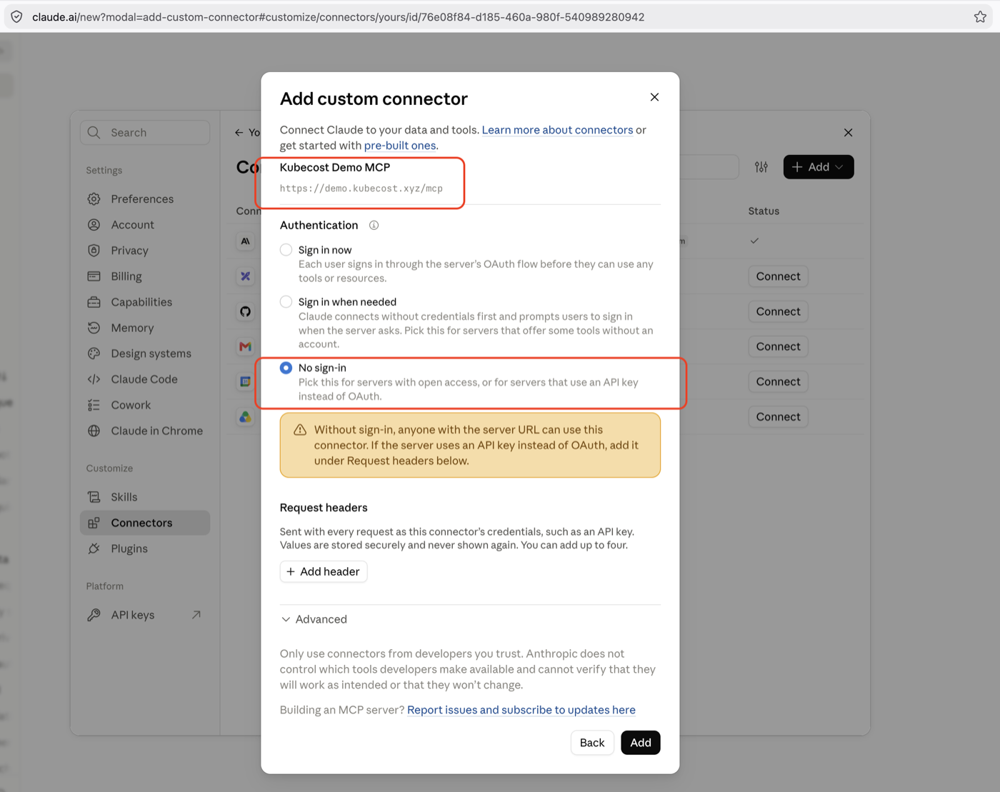
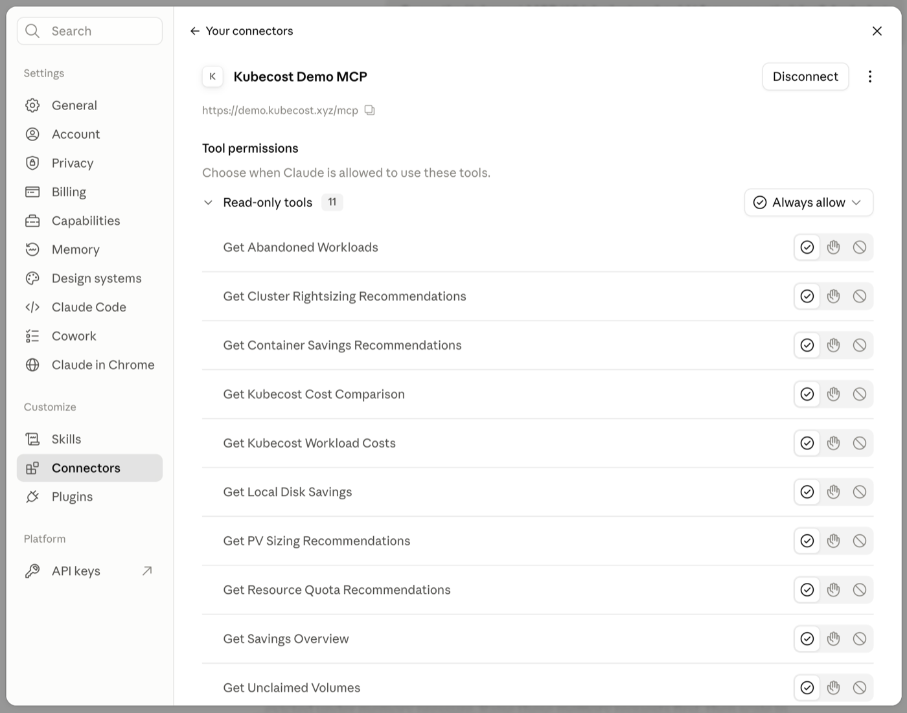

# Connecting an AI Assistant<!-- omit in toc -->

Point a client at the server's `/mcp` endpoint. Deploying the server: [the Helm chart](../../charts/mcp-kubecost/README.md). Protecting it: [docs/auth](../auth/README.md).

| Server `AUTH_MODE`   | Client sends       |
| -------------------- | ------------------ |
| `oidc` (recommended) | OAuth sign-in      |
| `api_key`            | `X-API-KEY` header |
| `none` / `open`      | Nothing            |

All 11 tools are read-only, so no client can change your cluster.

## Claude (web and desktop)

**Settings → Connectors → Add → Add custom connector.** Paste the URL, then pick **Sign in now** for `oidc`, or **No sign-in** otherwise — adding an `X-API-KEY` request header for `api_key`.



> [!IMPORTANT]
> The screenshot connects to the **public demo**, hence **No sign-in**. Use `oidc` for your own deployment — without it, anyone with the URL can read your cost data.

All 11 tools should appear:



Now ask: _"Where are my biggest savings opportunities?"_ ([more examples](../../README.md#examples-of-what-you-can-ask))

## Claude Code

```bash
# remote
claude mcp add --transport http kubecost https://kubecost.example.com/mcp

# remote, api_key mode
claude mcp add --transport http kubecost https://kubecost.example.com/mcp \
  --header "X-API-KEY: ${KUBECOST_API_KEY}"

# local, against a port-forward
claude mcp add kubecost --env KUBECOST_BASE_URL=http://localhost:9090 \
  -- uv run --directory /path/to/mcp-kubecost mcp-kubecost

# verify
claude mcp list
```

## ChatGPT

**Settings → Connectors**, developer mode, same `/mcp` URL. OpenAI connects from its own infrastructure, so the URL must be public HTTPS with a public CA certificate — a port-forward or internal DNS name will not work. Use `oidc`.

## Other clients

HTTP:

```json
{
  "mcpServers": {
    "mcp-kubecost": {
      "type": "streamable-http",
      "url": "https://kubecost.example.com/mcp"
    }
  }
}
```

STDIO:

```json
{
  "mcpServers": {
    "mcp-kubecost": {
      "command": "uv",
      "args": ["run", "--directory", "/path/to/mcp-kubecost", "mcp-kubecost"],
      "env": { "KUBECOST_BASE_URL": "http://localhost:9090" }
    }
  }
}
```

Working copies: [`config/mcp-http.json`](../../config/mcp-http.json), [`config/mcp-http-public.json`](../../config/mcp-http-public.json).

## Troubleshooting

Run these before debugging the client — if they fail, the fault is the server or the network:

```bash
curl -fsS https://kubecost.example.com/health

npx @modelcontextprotocol/inspector \
  --cli https://kubecost.example.com/mcp --method tools/list
```

| Symptom                      | Cause                                                                                    |
| ---------------------------- | ---------------------------------------------------------------------------------------- |
| Connects, no tools           | URL missing `/mcp`                                                                       |
| `401` or repeated sign-ins   | Client auth does not match `AUTH_MODE`                                                   |
| Tool calls all fail          | Server cannot reach Kubecost — check `KUBECOST_BASE_URL`, `KUBECOST_API_KEY`             |
| Long queries time out        | Gateway timeout shorter than the query ([chart README](../../charts/mcp-kubecost/README.md)) |
| Host or origin rejected      | Add the public origin to `config.externalUrl`                                            |
